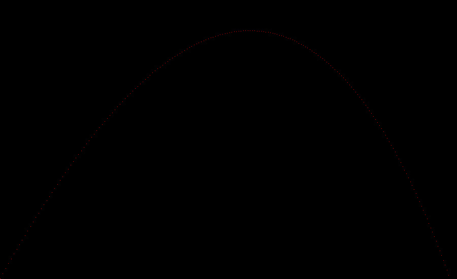

# RayTracerChallenge
My implementation of the ray tracer challenge, done in C++ to learn C++ as well as Ray Tracing

## How to generate a build

If you're running on Windows, run the provided batch file, vsbuild.bat. If you're on any other system, you'll have to use the premake5.exe in the vendors/bin/premake folder and pass in the environment you use. Here's the full list: https://premake.github.io/docs/Using-Premake/. Make sure the current directory is at the project root folder when you run.

## Chapter 2 Product
A projectile's motion. Rendered to test image outputting.


## Chapter 3 Product
No graphics for this chapter, but here's some terminal output about matricies:
```
What happens when you invert an identity matrix? It stays the same.
[1, 0, 0, 0, ]
[0, 1, 0, 0, ]
[0, 0, 1, 0, ]
[0, 0, 0, 1, ]
 ->
[1, -0, 0, -0, ]
[-0, 1, -0, 0, ]
[0, -0, 1, -0, ]
[-0, 0, -0, 1, ]

What do you get when you multiply a matrix by its inverse? The identity matrix.
[1, 2, 3, ]
[4, 5, 6, ]
[7, 10, 9, ]
 ->
[1, 0, 0, ]
[0, 1, 0, ]
[0, 0, 1, ]
Is there any difference between the inverse of the tranpose of a matrix, and the transpose of the inverse?
 yes
tuple(1, 24, 3, 4)
```
